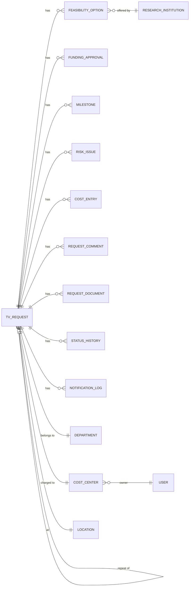

# 03 – Dataverse Data Model (tables, columns, sample data)

All tables are created in solution **TVRMS** with prefix **`tvr_`**.
How to create a table: **Solution → New → Table → Table**, give the name, then add columns.

## 1. Big picture (Entity Relationship)

## 2. Master data tables (customer provides data – slide 8)

### 2.1 Department (`tvr_department`)
| Column | Type | Required | Sample |
|---|---|---|---|
| Name (primary) | Text 100 | Yes | Process Engineering |
| Department Code | Text 20 | Yes | PE |
| Department Head | Lookup → User | No | Ravi Kumar |
| Is Active | Yes/No | Yes | Yes |

### 2.2 Cost Center (`tvr_costcenter`)
| Column | Type | Required | Sample |
|---|---|---|---|
| Name (primary) | Text 100 | Yes | CC-4100 Etch R&D |
| Cost Center Code | Text 20 | Yes | 4100 |
| **Cost Center Owner** | Lookup → User | Yes | Maria Lopez |
| Owner's Manager (for escalation / high value) | Lookup → User | No | James Wilson |
| Department | Lookup → Department | No | Process Engineering |
| Is Active | Yes/No | Yes | Yes |

### 2.3 Location (`tvr_location`)
| Column | Type | Sample |
|---|---|---|
| Name | Text | Fremont, CA |
| Country | Text | USA |
| Is Active | Yes/No | Yes |

### 2.4 Research Institution / Vendor (`tvr_researchinstitution`)
| Column | Type | Sample |
|---|---|---|
| Name | Text | Stanford Nanofab Lab |
| Type | Choice: University / Research Lab / Vendor / Internal Lab | University |
| Contact Name | Text | Dr. Alan Green |
| Contact Email | Email | agreen@stanford.example |
| Capabilities | Multiline text | Plasma etch, SEM, TEM |
| Is Active | Yes/No | Yes |

### 2.5 App Setting (`tvr_appsetting`) – business can change rules without code
| Name (Key) | Value | Description |
|---|---|---|
| ReminderAfterDays | 3 | Send reminder if pending action > 3 days |
| EscalationAfterDays | 5 | Escalate to manager if pending > 5 days |
| AutoCancelAfterDays | 30 | Auto-cancel if "More Info Required" > 30 days |
| HighValueFundingLimit | 50000 | Above this, 2nd-level approval |
| RetentionYears | 7 | Record retention |

### 2.6 Email Template (`tvr_emailtemplate`)
| Column | Type | Sample |
|---|---|---|
| Template Code (primary) | Text | REQ_SUBMITTED |
| Subject | Text | `[TVRMS] {TVID} submitted – {Title}` |
| Body (HTML) | Multiline | `
Dear {RequesterName},

Your request <b>{TVID}</b> has been submitted...
` |
| Is Active | Yes/No | Yes |

The flow replaces `{TVID}`, `{Title}`, `{RequesterName}`, `{Status}`, `{Link}`, `{Comments}` with real values.

## 3. Main table – TV Request (`tvr_tvrequest`)

Turn on: **Auditing**, **Track changes**. Ownership: **User or team**.

| # | Display name | Schema name | Type | Req.? | Sample value |
|---|---|---|---|---|---|
| 1 | **TVID** (primary) | `tvr_tvid` | **Autonumber** `TV-{DATETIMEUTC:yyyy}-{SEQNUM:5}` | auto | TV-2026-00015 |
| 2 | Request Title | `tvr_title` | Text 200 | Yes | Plasma etch uniformity test on 300mm wafers |
| 3 | Request Type | `tvr_requesttype` | Choice: New, Repeat, One-time, Recurring | Yes | New |
| 4 | Previous Request (for Repeat) | `tvr_parentrequest` | Lookup → TV Request | If Repeat | TV-2026-00003 |
| 5 | Recurrence Frequency | `tvr_frequency` | Choice: Monthly, Quarterly, Half-yearly, Yearly | If Recurring | Quarterly |
| 6 | Requester | `tvr_requester` | Lookup → User | Yes | Priya Sharma |
| 7 | Department | `tvr_department` | Lookup → Department | Yes | Process Engineering |
| 8 | Location | `tvr_location` | Lookup → Location | Yes | Fremont, CA |
| 9 | Cost Center | `tvr_costcenter` | Lookup → Cost Center | Yes | CC-4100 Etch R&D |
| 10 | Business Justification | `tvr_justification` | Multiline 4000 | Yes | Customer X reports 4% non-uniformity... |
| 11 | Technical Description | `tvr_technicaldescription` | Multiline 4000 | Yes | 25 wafers, 3 recipes, measure CD... |
| 12 | Expected Outcome | `tvr_expectedoutcome` | Multiline | Yes | Uniformity < 2% |
| 13 | Priority | `tvr_priority` | Choice: Low, Medium, High, Critical | Yes | High |
| 14 | Required By Date | `tvr_requiredbydate` | Date only | Yes | 2026-12-15 |
| 15 | Estimated Budget (USD) | `tvr_estimatedbudget` | Currency | Yes | 42,000 |
| 16 | **Request Status** (do NOT name it just "Status" – Dataverse already has a system column called Status) | `tvr_status` | Choice (see §4) | auto | Submitted |
| 17 | Current Phase | `tvr_phase` | Choice: Initiation, APPG Review, Internal Alignment, Funding Approval, Execution, Closure | auto | APPG Review |
| 18 | APPG Owner | `tvr_appgowner` | Lookup → User | at review | David Chen |
| 19 | Selected Option | `tvr_selectedoption` | Lookup → Feasibility Option | at alignment 2 | Stanford Nanofab – Option A |
| 20 | Approved Amount (USD) | `tvr_approvedamount` | Currency | at funding | 39,500 |
| 21 | Expected Completion Date | `tvr_expectedcompletion` | Date only | execution | 2027-02-28 |
| 22 | Overall Progress % | `tvr_progress` | Whole number 0-100 | execution | 60 |
| 23 | Actual Total Cost (USD) | `tvr_actualcost` | Currency (Rollup of Cost Entry) | auto | 37,800 |
| 24 | SharePoint Folder URL | `tvr_spfolderurl` | URL | auto | `https://lam.sharepoint.com/sites/TVRMS/TV Requests/TV-2026-00015` |
| 25 | Submitted On | `tvr_submittedon` | Date and time | auto | 2026-10-12 10:05 |
| 26 | Status Changed On | `tvr_statuschangedon` | Date and time | auto | used for reminders/aging |
| 27 | Closed On | `tvr_closedon` | Date and time | auto | 2027-03-05 |
| 28 | Final Outcome | `tvr_finaloutcome` | Multiline | at closure | Uniformity improved to 1.6% |
| 29 | Lessons Learned | `tvr_lessonslearned` | Multiline | at closure | Book lab 6 weeks early |
| 30 | Reuse Recommendation | `tvr_reuserecommendation` | Choice: Reuse as-is, Reuse with changes, Do not reuse | at closure | Reuse with changes |
| 31 | Rejection / Cancellation Reason | `tvr_reason` | Multiline | when rejected/cancelled | Duplicate of TV-2026-00011 |
| 32 | Cycle Time (days) | `tvr_cycletimedays` | Formula/Calculated: `DiffInDays(SubmittedOn, ClosedOn)` | auto | 144 |

## 4. Status list and allowed moves (ASSUMPTION – confirm in workshop)

| Code | Status | Phase | Who moves it next | Allowed next status |
|---|---|---|---|---|
| 1 | Draft | Initiation | Requester | Submitted, Cancelled |
| 2 | Submitted | APPG Review | APPG | Under APPG Review |
| 3 | Under APPG Review | APPG Review | APPG | More Info Required, Rejected, Internal Alignment 1 |
| 4 | More Info Required | APPG Review | Requester | Under APPG Review (resubmit), Cancelled (auto after 30 days) |
| 5 | Rejected | APPG Review | – (final) | – |
| 6 | Internal Alignment 1 | Internal Alignment | APPG | Internal Alignment 2 |
| 7 | Internal Alignment 2 | Internal Alignment | APPG | Pending Funding Approval |
| 8 | Pending Funding Approval | Funding Approval | CCO (via flow) | Funding Approved, Funding Rejected |
| 9 | Funding Rejected | Funding Approval | – (final) | – |
| 10 | Funding Approved | Funding Approval | APPG | In Execution |
| 11 | In Execution | Execution | APPG | On Hold, Execution Completed |
| 12 | On Hold | Execution | APPG | In Execution, Cancelled |
| 13 | Execution Completed | Closure | APPG | Closed |
| 14 | Closed | Closure | – (final) | – |
| 15 | Cancelled | any | – (final) | – |

Tip: put the "allowed next status" rules in **one place** (the Canvas app uses a
collection or a small table `tvr_statustransition`) so the rules are easy to change.

## 5. Child tables

### 5.1 Feasibility Option (`tvr_feasibilityoption`)
| Column | Type | Sample |
|---|---|---|
| Option Name (primary) | Text | Option A – Stanford Nanofab |
| TV Request | Lookup → TV Request | TV-2026-00015 |
| Research Institution | Lookup | Stanford Nanofab Lab |
| Capability Score (1-5) | Whole number | 5 |
| Quoted Cost (USD) | Currency | 39,500 |
| Timeline (weeks) | Whole number | 10 |
| Constraints | Multiline | Lab available only from Nov |
| Recommendation | Choice: Recommended, Alternative, Not Recommended | Recommended |
| Is Selected | Yes/No | Yes |
| Quote Document URL | URL | link to SharePoint file |

### 5.2 Funding Approval (`tvr_fundingapproval`)
| Column | Type | Sample |
|---|---|---|
| Name | Text (auto) | FA-TV-2026-00015-1 |
| TV Request | Lookup | TV-2026-00015 |
| Cost Center | Lookup | CC-4100 |
| Approver | Lookup → User | Maria Lopez |
| Approval Level | Whole number | 1 |
| Requested Amount | Currency | 39,500 |
| Decision | Choice: Pending, Approved, Rejected | Approved |
| Comments | Multiline | Approved from Q4 budget |
| Requested On / Decided On | Date time | 2026-11-02 / 2026-11-03 |

This table **is** the "approval history" asked in scope.

### 5.3 Milestone (`tvr_milestone`)
| Column | Type | Sample |
|---|---|---|
| Milestone Name | Text | Wafer preparation |
| TV Request | Lookup | TV-2026-00015 |
| Sequence | Whole number | 1 |
| Planned Start / Planned End | Date | 2026-11-10 / 2026-11-24 |
| Actual Start / Actual End | Date | 2026-11-12 / 2026-11-26 |
| % Complete | Whole number | 100 |
| Status | Choice: Not Started, In Progress, Completed, Delayed | Completed |

### 5.4 Risk / Issue (`tvr_riskissue`)
| Column | Type | Sample |
|---|---|---|
| Title | Text | Lab tool down for maintenance |
| TV Request | Lookup | TV-2026-00015 |
| Type | Choice: Risk, Issue, Exception | Issue |
| Severity | Choice: Low, Medium, High | High |
| Owner | Lookup → User | David Chen |
| Mitigation / Action | Multiline | Move run to 2nd lab |
| Status | Choice: Open, In Progress, Resolved | Resolved |
| Due Date | Date | 2026-12-05 |

### 5.5 Cost Entry (`tvr_costentry`)
| Column | Type | Sample |
|---|---|---|
| Description | Text | Lab usage fee – Nov |
| TV Request | Lookup | TV-2026-00015 |
| Category | Choice: Lab Fee, Material, Shipping, Labor, Other | Lab Fee |
| Amount (USD) | Currency | 18,000 |
| Cost Date | Date | 2026-11-30 |
| Invoice Reference | Text | INV-88213 |

Create a **Rollup column** on TV Request: `Actual Total Cost = SUM(Cost Entry.Amount)`.
**Utilization %** = Actual Total Cost / Approved Amount × 100 (calculated in Power BI or formula column).

### 5.6 Request Comment (`tvr_requestcomment`)
| Column | Type | Sample |
|---|---|---|
| Comment | Multiline | Please attach the wafer map. |
| TV Request | Lookup | TV-2026-00015 |
| Stage | Choice (same as Phase) | APPG Review |
| Comment Type | Choice: General, More Info Request, Requester Response, Decision | More Info Request |
| Created By / Created On | system | David Chen / 2026-10-13 |

### 5.7 Request Document (`tvr_requestdocument`) – metadata only, file lives in SharePoint
| Column | Type | Sample |
|---|---|---|
| File Name | Text | Etch_Test_Spec_v1.pdf |
| TV Request | Lookup | TV-2026-00015 |
| Document Type | Choice: Technical Specification, Supporting Document, Quote, Approval Evidence, Progress Report, Final Report | Technical Specification |
| SharePoint URL | URL | ... |
| Folder | Text | 02-Technical Documents |
| Uploaded On | Date time | 2026-10-12 |

### 5.8 Status History (`tvr_statushistory`) – audit trail in readable form
| Column | Type | Sample |
|---|---|---|
| Name | Text | TV-2026-00015: Submitted → Under APPG Review |
| TV Request | Lookup | TV-2026-00015 |
| From Status / To Status | Choice | Submitted / Under APPG Review |
| Changed By | Lookup → User | David Chen |
| Changed On | Date time | 2026-10-13 09:12 |
| Remarks | Multiline | Picked up for review |

### 5.9 Notification Log (`tvr_notificationlog`)
| Column | Type | Sample |
|---|---|---|
| Subject | Text | [TVRMS] TV-2026-00015 submitted |
| TV Request | Lookup | TV-2026-00015 |
| Template Code | Text | REQ_SUBMITTED |
| Sent To | Text | priya.sharma@lam.com |
| Sent On | Date time | 2026-10-12 10:06 |
| Result | Choice: Sent, Failed | Sent |
| Error Message | Multiline | (empty) |

### 5.10 Error Log (`tvr_errorlog`) – for "Exception Remediation"
| Column | Type | Sample |
|---|---|---|
| Flow Name | Text | F01 - On Request Submitted |
| TV Request | Lookup | TV-2026-00015 |
| Error | Multiline | SharePoint: folder already exists |
| Run URL | URL | link to failed flow run |
| Status | Choice: New, Fixed, Ignored | New |

## 6. Relationships – important settings

For all child tables → TV Request lookups, set relationship behavior:
- **Delete: Restrict** (never lose history; 7-year retention).
- **Assign/Share: Cascade All** (so when the request is shared with a CCO or stakeholder, children are shared too).

## 7. Business rules / validations in Dataverse (server side)

Even if the Canvas app checks fields, also add these (so data is safe from any entry point):

1. **Business Rule** on TV Request: if Request Type = Repeat → *Previous Request* is required.
2. **Business Rule**: if Request Type = Recurring → *Recurrence Frequency* is required.
3. **Business Rule**: Required By Date must be after today (show error).
4. Column *Estimated Budget* min value = 0.

## 8. How to load sample data

Files in [`/sample-data`](../sample-data). Load in this order (because of lookups):

1. `departments.csv`
2. `locations.csv`
3. `research_institutions.csv`
4. `cost_centers.csv`
5. `app_settings.csv`
6. `email_templates.csv`
7. `tv_requests.csv`
8. `feasibility_options.csv`
9. `milestones.csv`
10. `cost_entries.csv`

How: open the table → **Import → Import data from Excel/CSV** → map columns → Import.
(Users must exist in the environment first – they come from Entra ID.)
