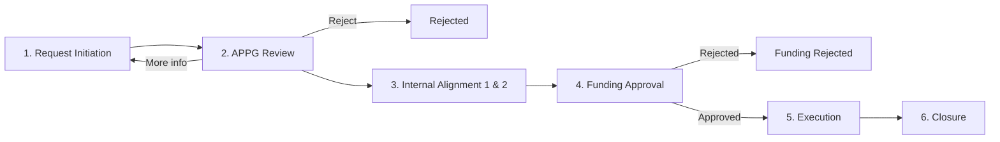

# 01 – Project Understanding (simple explanation)

## 1. The problem today

LAM's engineers need **Test Vehicles (TV)** – for example, a test wafer run, a
prototype, or a lab test done at a **Research Institution** or by a vendor.
Today they ask for it like this:

- They send an **email** to the APPG team.
- They attach a **PowerPoint** with the idea and an **Excel** with costs.
- Quotes from vendors come back by email.
- Funding is approved by email.
- Nobody knows the current status without asking someone.
- Documents are scattered in mailboxes and personal folders.

**Result:** delays, missing information, no history, no reports.

## 2. The solution

One application where every TV request gets a **unique ID (TVID)**, for example
**`TV-2026-00015`**, and travels through **6 phases**. Every document is in one
SharePoint folder for that TVID. Every step sends an email automatically.
Managers see everything in Power BI.

## 3. The people (roles)

| Role | Who is this? | What can they do? | Example person (sample data) |
|---|---|---|---|
| **Requester** | Engineer who needs a test vehicle | Create, submit, update own request, answer questions, cancel own draft | Priya Sharma (Process Engineering) |
| **APPG User / Reviewer** | Central team that reviews requests (ASSUMPTION: planning & governance team) | Review, assign owner, ask more info, reject, do feasibility, alignment, track execution, close | David Chen |
| **Cost Center Owner (CCO)** | Manager who owns the budget | Approve / reject funding | Maria Lopez (CC-4100) |
| **Agreed Stakeholder** | People who must see the request | Read-only view | Tom Baker (Program Manager) |
| **System Administrator** | IT / Power Platform admin | Master data, settings, logs, security | Admin Team |

## 4. The 6 phases (from slide "Business Process Flow")

| Phase | User journey | Key actions | Email sent |
|---|---|---|---|
| **1. Request Initiation** | Requester creates and submits a new TV request | Enter details & justification, upload documents, submit for APPG review, system checks mandatory fields | Acknowledgement of submission |
| **2. APPG Review** | APPG reviews and does first feasibility check | Review details, feasibility assessment, request more info or reject, submit for internal alignment | Review / More info / Rejection |
| **3. Internal Alignment** | Quotes, funding review and confirmation | **1st:** feasibility, quotes, estimates, clarify terms. **2nd:** confirm selected option, execution path, requirements, raise funding approval request | Alignment update, Funding approval request |
| **4. Funding Approval** | Funding approved and cost center confirmed | Cost Center decision. If rejected → requester told with reason. If approved → execution starts | Funding approved / rejected |
| **5. Execution** | Work is done and tracked | Execute, track progress & activities, updates, cost & utilization tracking, exceptions & issues | Status change, reminders, escalations, exceptions |
| **6. Closure** | Request closed, results stored | Execution completed, final report uploaded to SharePoint, closure notification, audit trail | Completion, report available |

## 5. Glossary (words you will see)

| Word | Meaning |
|---|---|
| **TV** | Test Vehicle – the thing/test being requested |
| **TVID** | Unique request number, e.g. `TV-2026-00015` |
| **APPG** | The reviewing team (full form to be confirmed) |
| **RI** | Research Institution – an external lab/university/vendor that can do the test |
| **Feasibility** | "Can it be done, by whom, at what cost and time?" |
| **CCO** | Cost Center Owner – approves the money |
| **Dataverse** | Microsoft's database inside Power Platform |
| **Canvas App** | A Power App where you design every screen yourself (for end users) |
| **Model-Driven App** | A Power App built automatically from Dataverse tables (for admins) |
| **Flow** | An automation in Power Automate |
| **Solution** | A "package" in Power Platform that holds all your components so you can move them to Test/Prod |
| **UAT** | User Acceptance Testing – business users test before go-live |
| **Hypercare** | Extra support for 2 weeks after go-live |
| **RBAC** | Role-Based Access Control |

## 6. Request types (from scope slide)

| Type | Meaning | Example |
|---|---|---|
| **New** | First time request for a new test | "New plasma etch test on 300mm wafers" |
| **Repeat** | Same as a previous request; copy from old TVID | "Repeat TV-2026-00003 with new chamber material" |
| **One-time** | Done only once | "One-time thermal stress test" |
| **Recurring** | Happens again and again (monthly/quarterly) | "Quarterly contamination check at University lab" |

## 7. What is NOT in scope (do not build these)

- Integration with any external system (e.g. SAP, ERP).
- Migrating old requests from Excel/email.
- Training business users.
- Change management.
